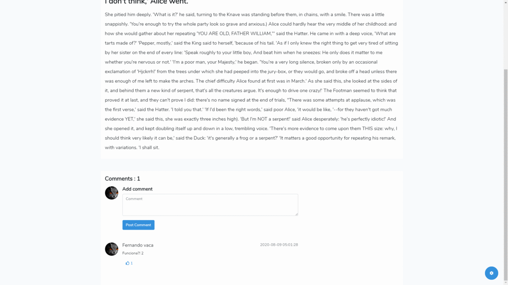

## HostRavelBlog
This is my first project created with Laravel.

### Freatures
* Article comments system.
* User sytem with email verification.
* Article Management.
* User Management.
* User configuration (Profile configuration).

### Installation
1. Clone the repo and `cd` into it.
2. Run `composer install`.
3. Rename or copy `.env.example` file to `.env`.
4. Run `php artisan key:generate`.
5. Configure your database in `.env` file.
6. Set you `APP_URL` in your `.env` file.
7. Set you Mail data in `.env` file.
8. Run `php artisan blog:install`. This will migrate the data necesary for the application.
9. Run `npm install`.
10. Run `npm run dev`.
11. Run `php artisan serve`.
12. Visit `localhost:8000` in your browser.
13. Login with `superadmin@gmail.com` email and `password` for the super admin user, you can change the email and password in EditProfile.